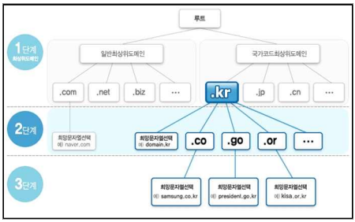

# DNS

---

## 1.1 DNS란 무엇인가

DNS(Domain Name System)는 **도메인 이름을 IP 주소로 변환하는 계층적 분산 데이터베이스 시스템**이다.

네트워크 통신은 IP 기반으로 이루어진다.

하지만 사용자는 숫자 대신 이름을 사용한다.

예:

```
www.example.com → 192.168.80.100
```

DNS는 이 매핑 정보를 전 세계적으로 분산된 서버에 저장하고 위임 구조로 관리한다.

---

## 1.2 DNS 계층 구조

도메인은 트리 구조이다.

[](DNS/image.png)

```
www.example.com.
```

구성 요소:

* `.` → Root

* `com` → TLD

* `example` → 2차 도메인

* `www` → 호스트 이름

오른쪽이 상위, 왼쪽이 하위이다.

DNS 질의는 루트에서 시작하여 점점 내려가는 구조이다.

---

## 1.3 도메인은 어디에서 관리되는가

실제 인터넷에서는 다음과 같은 구조로 관리된다.

1. Root → ICANN 관리

2. TLD(.com, .net, .kr 등) → 각 등록기관 관리

3. 사용자 → Registrar(등록 대행업체)를 통해 도메인 임대

도메인은 “구매”가 아니라 “임대” 개념이다.

보통 1년 단위 갱신한다.

---

## 1.4 정방향 / 역방향 조회

| 구분 | 정방향 | 역방향 |
| --- | --- | --- |
| 방향 | 이름 → IP | IP → 이름 |
| 레코드 | A / AAAA | PTR |
| 필수 여부 | 필수 | 선택적 |

PTR은 DNS 동작에 필수는 아니다.

하지만 메일 서버 운영 시 매우 중요하다.

---

## 1.5 nslookup과 PTR 관계

nslookup 실행 시:

```
Server: ns1.example.com
```

이 이름은 해당 DNS 서버 IP에 대한 PTR 레코드가 있어야 출력된다.

PTR이 없으면 IP로 표시된다.

DNS 동작과는 무관하다.

---

# 2. Caching Name Server

---

[](DNS/image%201.png)

## 2.1 이론

Caching Name Server는 재귀 질의를 수행하고 응답을 TTL 동안 캐시에 저장한다.

동작 흐름:

1. 클라이언트 질의

2. 루트 → TLD → 권한 서버 질의

3. 결과 수신

4. TTL 동안 캐시 저장

5. 동일 질의는 캐시 응답

TTL(Time To Live)은 캐시 유지 시간이다.

---

## 2.2 보안 주의

재귀를 외부에 개방하면 Open Resolver가 된다.

위험:

* DNS 증폭 공격

* DDoS 반사 공격

따라서 allow-recursion은 내부망으로 제한해야 한다.

---

## 2.3 실습: Caching DNS (192.168.80.110)

### 설치

```
sudo apt install -y bind9 bind9-utils bind9-dnsutils
```

| 패키지 | 설명 |
| --- | --- |
| bind9 | DNS 서버 프로그램(named) |
| bind9-utils | DNS 관리 도구 |
| bind9-dnsutils | dig, nslookup 같은 테스트 도구 |

### BIND 서비스 확인

설치 후 서비스 상태 확인

```
systemctl status bind9
```

정상 실행 상태 예시

```
Active: active (running)
```

서비스 시작 / 중지

```
sudo systemctl start bind9
sudo systemctl stop bind9
sudo systemctl restart bind9
```

부팅 시 자동 실행

```
sudo systemctl enable bind9
```

### BIND 설정 파일 구조

BIND 설정은 `/etc/bind` 디렉토리에 존재한다.

확인

```
ls /etc/bind
```

예시

```
named.conf
named.conf.options
named.conf.local
named.conf.default-zones
```

| 파일 | 역할 |
| --- | --- |
| named.conf | 메인 설정 파일 |
| named.conf.options | DNS 서버 기본 옵션 |
| named.conf.local | 사용자 정의 zone |
| named.conf.default-zones | 기본 zone |

```
vi /etc/bind/named.conf.options
```

```
options {
directory "/var/cache/bind";
dnssec-validation auto;

listen-on-v6 { any; };
};
```

### 테스트

```
dig @192.168.80.110 www.google.com
```

| 요소 | 의미 |
| --- | --- |
| @127.0.0.1 | 질의할 DNS 서버 |
| google.com | 조회할 도메인 |

두 번째 실행 시 응답이 빨라지면 캐시 정상이다.

DNS가 사용하는 전송계층 프로토콜

| 프로토콜 | 포트번호 | 용도 |
| --- | --- | --- |
| UDP | 53 | 일반 DNS 질의 |
| TCP | 53 | zone transfer, 큰 응답 |

---

# 3. Authoritative Name Server

recursion은 **재귀 질의 기능으로 DNS 서버가 클라이언트를 대신하여 도메인 조회를 수행하는 기능이다.**

DNS 서버가 관리하지 않는 도메인에 대한 질의가 들어오면 **루트 DNS부터 시작하여 TLD DNS, Authoritative DNS 순서로 질의를 진행하고 결과를 클라이언트에게 반환한다.**

BIND의 기본 설정은 **recursion 활성 상태이다.**

필요한 경우 `options` **블록에서 recursion을 비활성화할 수 있다.**

---

### 설정 예시

```
options {
    recursion no;
};
```

이렇게 설정하면

```
DNS 서버는 자신이 관리하는 zone 정보만 응답함
외부 도메인 조회는 수행하지 않음
```

즉

```
Resolver 기능 제거
Authoritative DNS 역할만 수행
```

## 3.1 이론

Authoritative DNS는 특정 Zone의 원본 데이터를 보유하고 정답을 제공한다.

특징:

* 재귀 수행하지 않음

* 자신이 관리하는 Zone만 응답

* SOA 포함

* NS 레코드 정의 필수

---

## 3.2 Domain vs Zone

* Domain → 이름 공간

* Zone → DNS 서버가 관리하는 단위

example.com과 test.com은 각각 독립 Zone이다.

---

# 4. Zone 등록

---

## 4.1 Zone(Domain)

/etc/named.rfc1912.zones 파일에 도메인을 등록한다.

```
zone "example.com" IN {
type master;
file "example.zone";
};
```

해당 zone 파일은 /var/named 디렉토리에 위치해야함.

## 4.1 Zone File이란

Zone File은 DNS의 실제 데이터베이스 파일이다.

위치:

```
/etc/bind
```

---

## 4.2 기본 구조

```
$TTL 86400
@   IN  SOA ns1.example.com. admin.example.com. (
        2026022101
        3600
        900
        604800
        86400
)

    IN  NS  ns1.example.com.

ns1 IN  A   192.168.80.53
www IN  A   192.168.80.100
```

---

## 4.3 zone transfer 항목 설명

| 항목 | 의미 |
| --- | --- |
| Serial | 변경 버전 번호 |
| Refresh | Slave 확인 주기 |
| Retry | 재시도 간격 |
| Expire | 만료 시간 |
| Minimum | 기본 TTL |

Serial 증가하지 않으면 Slave는 갱신하지 않는다.

---

## 4.4 주요 레코드

* A → IPv4

* PTR → 역방향

* NS → 권한 서버

* CNAME → 별칭

* MX → 메일 서버

---

# 5. Authoritative DNS 실습 (example.com, test.com)

---

## 환경

| 역할 | IP |
| --- | --- |
| Master | 192.168.80.110 |

---

### example.com Zone 정의

```
zone "example.com" IN {
    type master;
    file "example.com.zone";
};
```

---

### test.com Zone 정의

```
zone "test.com" IN {
    type master;
    file "test.com.zone";
};
```

---

### example.com Zone File

```
$TTL 86400
@   IN  SOA ns1.example.com. admin.example.com. (
        2026022101
        3600
        900
        604800
        86400
)

    IN  NS  ns1.example.com.

ns1 IN  A   192.168.80.53
www IN  A   192.168.80.100
```

---

### test.com Zone File

```
$TTL 86400
@   IN  SOA ns1.test.com. admin.test.com. (
        2026022101
        3600
        900
        604800
        86400
)

    IN  NS  ns1.test.com.

ns1 IN  A   192.168.80.53
www IN  A   192.168.80.110
```

---

### 문법 점검

```
named-checkconf
named-checkzone example.com /var/named/example.com.zone
named-checkzone test.com /var/named/test.com.zone
```

---

### 재시작

```
systemctl restart named
```

---

# 6. 사설 도메인 테스트

클라이언트 DNS 서버를 192.168.80.53으로 설정한다.

```
dig www.example.com
dig www.test.com
ping www.example.com
```

---

# 7. Zone Transfer

Zone Transfer는 Master의 Zone 데이터를 Slave로 복제하는 과정이다.

종류:

* AXFR → 전체 전송

* IXFR → 증분 전송

Slave는 SOA Serial 비교 후 동기화한다.

TCP 53 사용한다.

---

# 8. Master / Slave 실습

## 환경

| 역할 | IP |
| --- | --- |
| Master | 192.168.80.53 |
| Slave | 192.168.80.54 |

---

## Master 설정

```
zone "example.com" IN {
    type master;
    file "example.com.zone";
    allow-transfer { 192.168.80.54; };
};
```

---

## Slave 설정

```
zone "example.com" IN {
    type slave;
    file "slaves/example.com.zone";
    masters { 192.168.80.53; };
};
```

---

## Slave 시작

```
systemctl restart named
```

---

## Serial 변경 테스트

1. Master Serial 증가

2. Master 재시작

3. Slave 로그 확인

```
journalctl -u named -n 50
```

---

# 9. named-chroot

---

## 9.1 chroot란 무엇인가

`chroot`는 **프로세스의 루트 디렉터리를 변경하는 보안 기술**이다.

일반적으로 리눅스의 루트 디렉터리는:

```
/
```

하지만 chroot를 적용하면 특정 디렉터리를 루트처럼 인식하게 만든다.

예:

```
/var/named/chroot
```

named 프로세스 입장에서는 이 경로가 `/`가 된다.

즉,

```
실제 경로: /var/named/chroot/etc/named.conf
named가 보는 경로: /etc/named.conf
```

---

## 9.2 왜 DNS 서버에 chroot를 사용하는가

DNS 서버는 외부와 직접 통신하는 서비스이다.

취약점 발생 시:

* 파일 시스템 접근

* 시스템 파일 탈취

* 권한 상승 시도

위험이 발생할 수 있다.

chroot를 적용하면:

* 접근 가능한 디렉터리 범위 제한

* 시스템 전체 파일 접근 차단

* 침해 발생 시 피해 범위 최소화

즉, **보안 격리 목적**이다.

---

# 10. named-chroot 구조 이해

전통적 chroot 구조:

```
/var/named/chroot/
├── etc/
│   └── named.conf
├── var/
│   └── named/
│       ├── example.com.zone
│       └── slaves/
├── dev/
└── run/
```

named는 이 디렉터리를 루트처럼 인식한다.

---

---